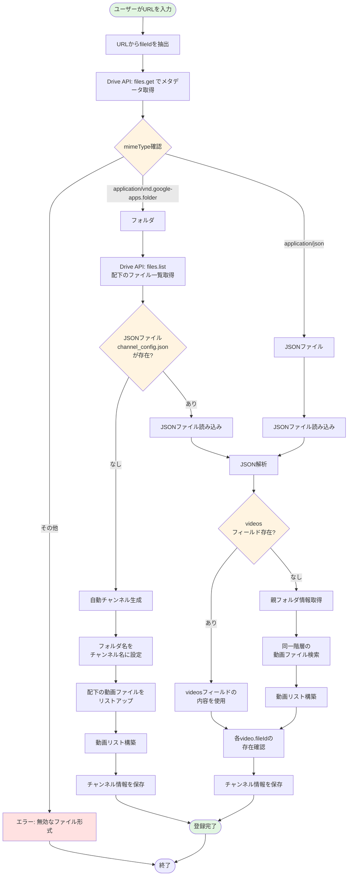

# Feedivo チャンネル登録柔軟化 - 移行パス詳細ドキュメント

## 目次

1. [概要](#概要)
2. [現在の実装の制約](#現在の実装の制約)
3. [新機能の詳細](#新機能の詳細)
4. [チャンネル登録フロー](#チャンネル登録フロー)
5. [実装手順](#実装手順)
6. [コード変更詳細](#コード変更詳細)
7. [テストシナリオ](#テストシナリオ)
8. [エラーハンドリング](#エラーハンドリング)
9. [後方互換性](#後方互換性)
10. [パフォーマンス考慮事項](#パフォーマンス考慮事項)

---

## 概要

この移行パスでは、Feedivoアプリのチャンネル登録機能を柔軟化し、以下の機能を実装します:

- **フォルダURL対応**: Google DriveのフォルダURLを直接指定可能に
- **複数動画形式のサポート**: mp4に加えて、webm、mov、avi、mkvなどをサポート
- **JSONファイル自動検出**: フォルダ内の`channel_config.json`を自動検出
- **自動チャンネル生成**: JSONがない場合、フォルダから自動的にチャンネル情報を生成

### 目的

ユーザーがチャンネルを登録する際の障壁を下げ、以下のような簡単な登録を可能にします:

1. Google DriveのフォルダURLをコピー＆ペーストするだけ
2. JSONファイルを書かずに即座に利用開始
3. 後からJSONで詳細設定を追加可能

---

## 現在の実装の制約

### サポートされているURL形式

現在は以下のパターンのみサポート:

```
https://drive.google.com/file/d/{fileId}/view
```

または直接 `{fileId}` を入力。

### サポートされていないパターン

- フォルダURL: `https://drive.google.com/drive/folders/{folderId}`
- 共有URL: `https://drive.google.com/open?id={fileId}`

### 動画形式の制約

現在は `video/mp4` のみ自動検出。webm、mov などは検出されません。

### JSON要件

チャンネルを登録するには、必ず `channel_config.json` ファイルを作成する必要があります。

---

## 新機能の詳細

### 1. 入力パターンの拡張

#### パターンA: ディレクトリURL指定

```
https://drive.google.com/drive/folders/{folderId}
```

**サブパターンA-1: 配下にJSONファイルなし**
- フォルダ名 → チャンネル名
- 配下の動画ファイル → 動画リスト
- 自動的にチャンネル情報を生成

**サブパターンA-2: 配下にJSONファイルあり（`channel_config.json`）**
- JSONファイルを自動検出して利用
- 既存のJSONベース登録と同じフロー

#### パターンB: ファイルURL指定（既存機能）

```
https://drive.google.com/file/d/{fileId}/view
```

- JSONファイルの場合のみ有効
- 既存の挙動を維持

#### パターンC: 共有URL指定（新規）

```
https://drive.google.com/open?id={fileId}
```

- FileまたはFolderのIDを抽出
- パターンAまたはパターンBのフローに分岐

### 2. JSON処理パターンの拡張

#### パターン1: `videos`フィールドあり

```json
{
  "version": "1.0",
  "channel": {...},
  "videos": [...]  // このリストを使用
}
```

既存の挙動を維持。

#### パターン2: `videos`フィールドなし

```json
{
  "version": "1.0",
  "channel": {...}
  // videosなし → 同一階層の動画ファイルを自動取得
}
```

同一階層（JSONファイルの親フォルダ）にある動画ファイルを自動検出。

### 3. 動画ファイルの自動検出

#### サポートする動画形式

| 形式 | MIMEタイプ | 拡張子 |
|------|-----------|--------|
| MP4 | video/mp4 | .mp4 |
| WebM | video/webm | .webm |
| QuickTime | video/quicktime | .mov |
| AVI | video/x-msvideo | .avi |
| Matroska | video/x-matroska | .mkv |

#### 検出ロジック

1. 各MIMEタイプでフォルダ内のファイル一覧を取得
2. 各動画ファイルから以下の情報を生成:
   - `id`: ファイルID
   - `title`: ファイル名から拡張子を除去
   - `description`: ファイル名
   - `videoFileId`: ファイルID
   - `duration`: 0（再生時に取得）
   - `publishedAt`: `createdTime` または `modifiedTime`

---

## チャンネル登録フロー

### フローチャート



### 処理の流れ（詳細）

#### Step 1: URL解析とファイル情報取得

1. `GoogleDriveService.extractFileId(url)` でURLからfileIdを抽出
2. `GoogleDriveService.getFileMetadata(fileId)` でメタデータを取得
3. `mimeType` を確認してフォルダかファイルかを判別

#### Step 2: フォルダの場合の処理

1. `GoogleDriveService.listFilesInFolder(folderId)` で配下のファイル一覧を取得
2. `channel_config.json` という名前のファイルを検索
3. JSONがあれば→ Step 3へ
4. JSONがなければ→ Step 4（自動生成）へ

#### Step 3: JSONファイルの処理

1. JSONファイルをダウンロードしてパース
2. `videos` フィールドの有無を確認
3. `videos` があれば→ そのリストを使用
4. `videos` がなければ→ 親フォルダの動画を自動検出

#### Step 4: 自動チャンネル生成

1. フォルダ名を取得してチャンネル名に設定
2. 配下の動画ファイルを検出（全形式）
3. チャンネルIDを `folder_{folderId}` として生成
4. Firestoreに保存

---

## 実装手順

### Phase 1: URL解析の拡張とフォルダ判別

#### 1.1 GoogleDriveService.extractFileId() の拡張

**ファイル**: `lib/data/services/google_drive_service.dart`

**変更前**:
```dart
String extractFileId(String input) {
  // すでにFile IDの形式の場合はそのまま返す
  final fileIdPattern = RegExp(r'^[a-zA-Z0-9_-]{20,}$');
  if (fileIdPattern.hasMatch(input)) {
    return input;
  }

  // URLからFile IDを抽出
  final urlPattern = RegExp(r'/d/([a-zA-Z0-9_-]+)');
  final match = urlPattern.firstMatch(input);
  if (match != null) {
    return match.group(1)!;
  }

  // マッチしない場合はそのまま返す（エラーは呼び出し側で処理）
  return input;
}
```

**変更後**:
```dart
String extractFileId(String input) {
  // すでにFile IDの形式の場合はそのまま返す
  final fileIdPattern = RegExp(r'^[a-zA-Z0-9_-]{20,}$');
  if (fileIdPattern.hasMatch(input)) {
    return input;
  }

  // パターン1: /d/FILE_ID (既存)
  final filePattern = RegExp(r'/d/([a-zA-Z0-9_-]+)');
  final fileMatch = filePattern.firstMatch(input);
  if (fileMatch != null) {
    return fileMatch.group(1)!;
  }

  // パターン2: /drive/folders/FOLDER_ID (新規)
  final folderPattern = RegExp(r'/drive/folders/([a-zA-Z0-9_-]+)');
  final folderMatch = folderPattern.firstMatch(input);
  if (folderMatch != null) {
    return folderMatch.group(1)!;
  }

  // パターン3: /open?id=FILE_ID (新規)
  final openPattern = RegExp(r'/open\?id=([a-zA-Z0-9_-]+)');
  final openMatch = openPattern.firstMatch(input);
  if (openMatch != null) {
    return openMatch.group(1)!;
  }

  // マッチしない場合はそのまま返す
  return input;
}
```

#### 1.2 フォルダ判別メソッドの追加

**ファイル**: `lib/data/services/google_drive_service.dart`

```dart
/// フォルダかファイルかを判別
Future<bool> isFolder(String fileId) async {
  try {
    final metadata = await getFileMetadata(fileId);
    final mimeType = metadata['mimeType'] as String?;
    return mimeType == 'application/vnd.google-apps.folder';
  } on Exception {
    return false;
  }
}

/// フォルダ名を取得
Future<String> getFolderName(String folderId) async {
  final metadata = await getFileMetadata(folderId);
  return metadata['name'] as String? ?? 'Untitled Folder';
}
```

#### 1.3 GoogleDriveRepository のラッパー追加

**ファイル**: `lib/data/repositories/google_drive_repository.dart`

```dart
Future<bool> isFolder(String fileId) {
  return _driveService.isFolder(fileId);
}

Future<String> getFolderName(String folderId) {
  return _driveService.getFolderName(folderId);
}
```

---

### Phase 2: フォルダ処理フローの実装

#### 2.1 ChannelRepository.addChannel() のリファクタリング

**ファイル**: `lib/data/repositories/channel_repository.dart`

**変更前**:
```dart
Future<Channel> addChannel(String userId, String configFileId) async {
  try {
    // File IDを抽出（URLの場合）
    final fileId = _driveRepo.extractFileId(configFileId);

    // Google Driveから設定ファイルを取得
    final configJson = await _driveRepo.downloadFileAsString(fileId);

    // JSONをパース
    final configData = json.decode(configJson) as Map<String, dynamic>;
    final config = ChannelConfigModel.fromJson(configData);

    // ... 以下続く
  }
}
```

**変更後**:
```dart
Future<Channel> addChannel(String userId, String configFileId) async {
  try {
    // File IDを抽出（URLの場合）
    final fileId = _driveRepo.extractFileId(configFileId);

    // フォルダかファイルかを判別
    final isFolder = await _driveRepo.isFolder(fileId);

    if (isFolder) {
      // フォルダの場合の処理（新規フロー）
      return await _addChannelFromFolder(userId, fileId);
    } else {
      // ファイルの場合の処理（既存フロー）
      return await _addChannelFromFile(userId, fileId);
    }
  } on InvalidConfigException {
    rethrow;
  } on DriveApiException {
    rethrow;
  } on Exception catch (e) {
    throw FirestoreException('チャンネルの追加に失敗しました: $e');
  }
}
```

#### 2.2 ファイル処理フローの分離

**ファイル**: `lib/data/repositories/channel_repository.dart`

```dart
/// ファイルからチャンネル追加（既存のaddChannelの中身）
Future<Channel> _addChannelFromFile(String userId, String fileId) async {
  // Google Driveから設定ファイルを取得
  final configJson = await _driveRepo.downloadFileAsString(fileId);

  // JSONをパース
  final configData = json.decode(configJson) as Map<String, dynamic>;
  final config = ChannelConfigModel.fromJson(configData);

  // チャンネル情報を作成
  final now = DateTime.now();
  final channelRef = _firestore
      .collection('users')
      .doc(userId)
      .collection('channels')
      .doc(config.channelInfo.id);

  final channelModel = ChannelModel(
    id: config.channelInfo.id,
    userId: userId,
    name: config.channelInfo.name,
    description: config.channelInfo.description,
    thumbnailFileId: config.channelInfo.thumbnailFileId,
    configFileId: fileId,
    configLastUpdated: config.channelInfo.updatedAt,
    createdAt: now,
    updatedAt: now,
    lastFetchedAt: now,
  );

  // Firestoreに保存
  await channelRef.set(channelModel.toFirestore());

  // 動画リストを同期（videosが空の場合は動画ファイルを自動検出）
  await _syncVideos(userId, config.channelInfo.id, config.videos, fileId);

  return channelModel.toEntity();
}
```

#### 2.3 フォルダ処理フローの実装

**ファイル**: `lib/data/repositories/channel_repository.dart`

```dart
/// フォルダからチャンネル追加
Future<Channel> _addChannelFromFolder(String userId, String folderId) async {
  // フォルダ内のchannel_config.jsonを検索
  final configFile = await _findChannelConfig(folderId);

  if (configFile != null) {
    // JSONファイルがある場合: 既存フローで処理
    return await _addChannelFromFile(userId, configFile['id'] as String);
  } else {
    // JSONファイルがない場合: 自動生成フロー
    return await _addChannelFromFolderAutoGenerate(userId, folderId);
  }
}

/// channel_config.jsonを検索
Future<Map<String, dynamic>?> _findChannelConfig(String folderId) async {
  final files = await _driveRepo.listFilesInFolder(folderId);

  for (final file in files) {
    final name = file['name'] as String?;
    if (name == 'channel_config.json') {
      return file;
    }
  }

  return null;
}

/// フォルダから自動生成
Future<Channel> _addChannelFromFolderAutoGenerate(
  String userId,
  String folderId,
) async {
  // フォルダ名を取得してチャンネル名として使用
  final folderName = await _driveRepo.getFolderName(folderId);

  // チャンネルIDを生成（フォルダIDを使用）
  final channelId = 'folder_$folderId';

  // フォルダ内の動画ファイルを検出（拡張版）
  final videos = await _autoDetectVideoFiles(folderId);

  if (videos.isEmpty) {
    throw InvalidConfigException(
      'フォルダ内に動画ファイルが見つかりませんでした。',
    );
  }

  // チャンネル情報を作成
  final now = DateTime.now();
  final channelRef = _firestore
      .collection('users')
      .doc(userId)
      .collection('channels')
      .doc(channelId);

  final channelModel = ChannelModel(
    id: channelId,
    userId: userId,
    name: folderName,
    description: 'フォルダから自動生成されたチャンネル',
    thumbnailFileId: null,
    configFileId: folderId, // フォルダIDを保存
    configLastUpdated: now,
    createdAt: now,
    updatedAt: now,
    lastFetchedAt: now,
  );

  // Firestoreに保存
  await channelRef.set(channelModel.toFirestore());

  // 動画リストを同期
  await _syncVideos(userId, channelId, videos, folderId);

  return channelModel.toEntity();
}
```

---

### Phase 3: 動画形式の拡張

#### 3.1 _autoDetectVideoFiles() の実装

**ファイル**: `lib/data/repositories/channel_repository.dart`

```dart
/// 設定ファイルと同じフォルダ内の動画ファイルを自動検出（複数形式対応）
Future<List<VideoInfoModel>> _autoDetectVideoFiles(String folderId) async {
  try {
    // サポートする動画形式のリスト
    const supportedVideoTypes = [
      'video/mp4',
      'video/webm',
      'video/quicktime', // .mov
      'video/x-msvideo', // .avi
      'video/x-matroska', // .mkv
    ];

    final allVideos = <VideoInfoModel>[];

    // 各形式ごとにファイルを検索
    for (final mimeType in supportedVideoTypes) {
      final files = await _driveRepo.listFilesInFolder(
        folderId,
        mimeTypeFilter: mimeType,
      );

      // 各動画ファイルから動画情報を生成
      for (final file in files) {
        final fileId = file['id'] as String;
        final fileName = file['name'] as String;
        final createdTime = file['createdTime'] as String?;
        final modifiedTime = file['modifiedTime'] as String?;

        // ファイル名から拡張子を除去してタイトルを生成
        final title = fileName.replaceAll(
          RegExp(r'\.(mp4|webm|mov|avi|mkv)$', caseSensitive: false),
          '',
        );

        allVideos.add(
          VideoInfoModel(
            id: fileId,
            title: title,
            description: fileName,
            videoFileId: fileId,
            duration: 0, // durationは再生時に取得される
            publishedAt: createdTime != null
                ? DateTime.parse(createdTime)
                : (modifiedTime != null
                    ? DateTime.parse(modifiedTime)
                    : DateTime.now()),
          ),
        );
      }
    }

    // createdTimeでソート（古い順）
    allVideos.sort((a, b) => a.publishedAt.compareTo(b.publishedAt));

    return allVideos;
  } on Exception {
    // エラーが発生した場合は空リストを返す
    return [];
  }
}
```

#### 3.2 既存の _autoDetectMp4Files() を _autoDetectVideoFiles() で置き換え

**変更箇所**:
- `_syncVideos()` メソッド内の `_autoDetectMp4Files()` 呼び出しを `_autoDetectVideoFiles()` に変更
- `_autoDetectMp4Files()` メソッドを削除

---

### Phase 4: UI/UX改善

#### 4.1 AddChannelScreen のバリデーション更新

**ファイル**: `lib/presentation/screens/channel/add_channel_screen.dart`

```dart
String? _validateFileId(String? value) {
  if (value == null || value.isEmpty) {
    return 'File IDまたはURLを入力してください';
  }

  // URLの場合は複数パターンに対応
  if (value.contains('drive.google.com')) {
    // パターン1: /d/FILE_ID
    // パターン2: /drive/folders/FOLDER_ID
    // パターン3: /open?id=FILE_ID
    final patterns = [
      RegExp(r'/d/([a-zA-Z0-9_-]+)'),
      RegExp(r'/drive/folders/([a-zA-Z0-9_-]+)'),
      RegExp(r'/open\?id=([a-zA-Z0-9_-]+)'),
    ];

    final hasMatch = patterns.any((pattern) => pattern.hasMatch(value));
    if (!hasMatch) {
      return '有効なGoogle Drive URLではありません';
    }
  } else {
    // File IDの場合は英数字、ハイフン、アンダースコアのみ
    final fileIdPattern = RegExp(r'^[a-zA-Z0-9_-]+$');
    if (!fileIdPattern.hasMatch(value)) {
      return '有効なFile IDではありません';
    }
  }

  return null;
}
```

#### 4.2 UI説明テキストの更新

**ファイル**: `lib/presentation/screens/channel/add_channel_screen.dart`

```dart
// 説明テキストを更新
Text(
  'Google Driveのファイル・フォルダのIDまたは\n共有URLを入力してください',
  style: AppTypography.body1.copyWith(
    color: AppColors.secondaryText,
  ),
  textAlign: TextAlign.center,
),

// ヘルプテキストを更新
Text(
  'ファイルURL、フォルダURL、またはIDを貼り付けてください',
  style: AppTypography.caption.copyWith(
    color: AppColors.disabledText,
  ),
),

// 説明カードを更新
Text(
  '設定ファイル（JSON形式）またはフォルダのURLを入力できます。'
  'フォルダの場合は、配下の動画ファイルが自動的に検出されます。',
  style: AppTypography.caption.copyWith(
    color: AppColors.secondaryText,
  ),
),
```

#### 4.3 ChannelProvider のエラーメッセージ改善

**ファイル**: `lib/presentation/providers/channel_provider.dart`

```dart
} on InvalidConfigException catch (e, stackTrace) {
  // 設定ファイルのフォーマットエラー
  debugPrint('[ChannelProvider] InvalidConfigException: ${e.message}');
  debugPrint('[ChannelProvider] スタックトレース: $stackTrace');
  _isLoading = false;

  // フォルダ内に動画ファイルがない場合の特別なメッセージ
  if (e.message.contains('動画ファイルが見つかりませんでした')) {
    _errorMessage = 'フォルダ内に動画ファイルが見つかりませんでした。\n'
        '対応形式: mp4, webm, mov, avi, mkv';
  } else {
    _errorMessage = '設定ファイルの形式が正しくありません。\n${e.message}';
  }

  notifyListeners();
  return false;
}
```

---

### Phase 5: refreshChannel() の更新

#### 5.1 フォルダベースチャンネルの更新対応

**ファイル**: `lib/data/repositories/channel_repository.dart`

```dart
Future<Channel> refreshChannel(String userId, String channelId) async {
  try {
    // 既存のチャンネル情報を取得
    final channelDoc = await _firestore
        .collection('users')
        .doc(userId)
        .collection('channels')
        .doc(channelId)
        .get();

    if (!channelDoc.exists) {
      throw FirestoreException('チャンネルが見つかりません');
    }

    final channelModel = ChannelModel.fromFirestore(channelDoc);

    // configFileIdがフォルダかファイルかを判別
    final isFolder = await _driveRepo.isFolder(channelModel.configFileId);

    if (isFolder) {
      // フォルダベースのチャンネル更新
      return await _refreshChannelFromFolder(userId, channelId, channelModel);
    } else {
      // ファイルベースのチャンネル更新（既存処理）
      return await _refreshChannelFromFile(userId, channelId, channelModel);
    }
  } on InvalidConfigException {
    rethrow;
  } on DriveApiException {
    rethrow;
  } on Exception catch (e) {
    throw FirestoreException('チャンネルの更新に失敗しました: $e');
  }
}

/// フォルダベースチャンネルの更新
Future<Channel> _refreshChannelFromFolder(
  String userId,
  String channelId,
  ChannelModel channelModel,
) async {
  // フォルダ内のchannel_config.jsonを検索
  final configFile = await _findChannelConfig(channelModel.configFileId);

  if (configFile != null) {
    // JSONファイルがある場合: ファイルベース更新に移行
    return await _refreshChannelFromFile(
      userId,
      channelId,
      channelModel.copyWith(configFileId: configFile['id'] as String),
    );
  } else {
    // JSONファイルがない場合: 動画リストを再取得
    final videos = await _autoDetectVideoFiles(channelModel.configFileId);

    if (videos.isEmpty) {
      throw InvalidConfigException(
        'フォルダ内に動画ファイルが見つかりませんでした。',
      );
    }

    // 動画リストを同期
    await _syncVideos(userId, channelId, videos, channelModel.configFileId);

    // lastFetchedAtを更新
    final now = DateTime.now();
    await _firestore
        .collection('users')
        .doc(userId)
        .collection('channels')
        .doc(channelId)
        .update({
          'lastFetchedAt': Timestamp.fromDate(now),
        });

    return channelModel.copyWith(lastFetchedAt: now).toEntity();
  }
}

/// ファイルベースチャンネルの更新（既存処理）
Future<Channel> _refreshChannelFromFile(
  String userId,
  String channelId,
  ChannelModel channelModel,
) async {
  // 既存のrefreshChannelの中身をここに移動
  // （省略）
}
```

---

## コード変更詳細

### ChannelModel の copyWith メソッド追加

**ファイル**: `lib/data/models/channel_model.dart`

```dart
ChannelModel copyWith({
  String? id,
  String? userId,
  String? name,
  String? description,
  String? thumbnailFileId,
  String? configFileId,
  DateTime? configLastUpdated,
  DateTime? createdAt,
  DateTime? updatedAt,
  DateTime? lastFetchedAt,
}) {
  return ChannelModel(
    id: id ?? this.id,
    userId: userId ?? this.userId,
    name: name ?? this.name,
    description: description ?? this.description,
    thumbnailFileId: thumbnailFileId ?? this.thumbnailFileId,
    configFileId: configFileId ?? this.configFileId,
    configLastUpdated: configLastUpdated ?? this.configLastUpdated,
    createdAt: createdAt ?? this.createdAt,
    updatedAt: updatedAt ?? this.updatedAt,
    lastFetchedAt: lastFetchedAt ?? this.lastFetchedAt,
  );
}
```

---

## テストシナリオ

### シナリオ1: フォルダURL指定（JSONなし）

**手順**:
1. Google Driveにテスト用フォルダを作成
2. フォルダ内にmp4、webm、mov形式の動画ファイルを配置
3. フォルダのURLをコピー: `https://drive.google.com/drive/folders/{folderId}`
4. Feedivoアプリでチャンネル追加画面を開く
5. フォルダURLを入力して追加

**期待結果**:
- フォルダ名がチャンネル名として表示される
- 配下の全動画ファイル（mp4、webm、mov）が動画リストに表示される
- 動画タイトルはファイル名から拡張子を除去したもの
- エラーが発生しない

### シナリオ2: フォルダURL指定（JSONあり）

**手順**:
1. Google Driveにテスト用フォルダを作成
2. フォルダ内に`channel_config.json`を配置
3. JSONファイルに以下の内容を記述:
   ```json
   {
     "version": "1.0",
     "channel": {
       "id": "test_channel",
       "name": "テストチャンネル",
       "description": "JSONベースのテストチャンネル",
       "updated_at": "2025-01-05T00:00:00Z"
     },
     "videos": []
   }
   ```
4. フォルダ内に動画ファイルを配置
5. フォルダURLを入力して追加

**期待結果**:
- JSONで定義したチャンネル名「テストチャンネル」が表示される
- `videos`フィールドが空なので、配下の動画ファイルが自動検出される
- エラーが発生しない

### シナリオ3: ファイルURL指定（既存機能）

**手順**:
1. Google Driveに`channel_config.json`を配置
2. JSONファイルに完全な設定（`videos`フィールドあり）を記述
3. ファイルのURLをコピー: `https://drive.google.com/file/d/{fileId}/view`
4. ファイルURLを入力して追加

**期待結果**:
- JSONで定義したチャンネル情報が表示される
- JSONで定義した動画リストが表示される
- 既存の挙動と同じ

### シナリオ4: 複数動画形式の検出

**手順**:
1. フォルダ内に以下の動画ファイルを配置:
   - `video1.mp4`
   - `video2.webm`
   - `video3.mov`
   - `video4.avi`
   - `video5.mkv`
2. フォルダURLを入力して追加

**期待結果**:
- すべての動画形式（5本）が検出される
- 動画タイトルは拡張子を除去したもの（video1、video2、...）
- 公開日時はファイルの`createdTime`

### シナリオ5: エラーケース - 動画ファイルなし

**手順**:
1. Google Driveに空のフォルダを作成
2. フォルダURLを入力して追加

**期待結果**:
- エラーメッセージが表示される:
  ```
  フォルダ内に動画ファイルが見つかりませんでした。
  対応形式: mp4, webm, mov, avi, mkv
  ```
- チャンネルは追加されない

### シナリオ6: エラーケース - アクセス権限なし

**手順**:
1. 他のユーザーの非共有フォルダURLを入力
2. 追加を試行

**期待結果**:
- エラーメッセージが表示される:
  ```
  フォルダへのアクセス権限がありません。
  Google Driveの共有設定を確認してください。
  ```
- チャンネルは追加されない

### シナリオ7: エラーケース - JSON以外のファイル

**手順**:
1. Google Driveに動画ファイル（.mp4）をアップロード
2. 動画ファイルのURLを入力して追加

**期待結果**:
- エラーメッセージが表示される:
  ```
  設定ファイルの形式が正しくありません。
  ```
- チャンネルは追加されない

---

## エラーハンドリング

### エラーケース一覧

| エラーケース | 例外型 | ユーザーメッセージ | 処理方法 |
|-------------|--------|------------------|---------|
| フォルダ内に動画ファイルなし | `InvalidConfigException` | 「フォルダ内に動画ファイルが見つかりませんでした。\n対応形式: mp4, webm, mov, avi, mkv」 | チャンネル追加をキャンセル |
| フォルダ内にJSONファイルが複数 | なし | なし | 最初に見つかった`channel_config.json`を使用 |
| JSON以外のファイルURLを指定 | `InvalidConfigException` | 「設定ファイルの形式が正しくありません。」 | チャンネル追加をキャンセル |
| フォルダへのアクセス権限なし | `PermissionDeniedException` | 「フォルダへのアクセス権限がありません。\nGoogle Driveの共有設定を確認してください。」 | チャンネル追加をキャンセル |
| 動画ファイルのMIMEタイプ不明 | なし | なし | 該当ファイルをスキップして続行 |
| 無効なURL形式 | バリデーションエラー | 「有効なGoogle Drive URLではありません」 | 入力フォームでエラー表示 |
| ファイルが見つからない | `FileNotFoundException` | 「ファイルが見つかりません。URLまたはFile IDを確認してください。」 | チャンネル追加をキャンセル |

### エラーメッセージのローカライゼーション

すべてのエラーメッセージは日本語で表示されます。将来的に多言語対応する場合は、以下のようにエラーコードを定義して対応します:

```dart
enum ChannelErrorCode {
  noVideoFilesFound,
  invalidFileFormat,
  permissionDenied,
  fileNotFound,
  invalidUrl,
}

String getErrorMessage(ChannelErrorCode code, String locale) {
  // ローカライゼーションロジック
}
```

---

## 後方互換性

### 既存チャンネルへの影響

#### ファイルベースチャンネル

**影響**: なし

- `configFileId`がファイルIDの場合、`isFolder()`でファイルと判定される
- 既存の`_addChannelFromFile()`または`_refreshChannelFromFile()`で処理される
- 挙動は変わらない

#### 自動検出チャンネル（mp4のみ）

**影響**: 軽微（拡張のみ）

- 既存の`_autoDetectMp4Files()`は`_autoDetectVideoFiles()`に置き換えられる
- mp4は引き続きサポートされる
- mp4以外の動画形式も検出されるようになる（拡張）

### refreshChannel() の挙動

#### ファイルベースチャンネル

- `configFileId`がファイルIDの場合、既存の挙動を維持
- JSONファイルを再ダウンロードして更新

#### フォルダベースチャンネル

- `configFileId`がフォルダIDの場合、新しいフローで処理
- フォルダ内に`channel_config.json`があれば、ファイルベース更新に移行
- JSONがなければ、動画リストを再取得

### データ整合性

#### チャンネルID

- ファイルベース: JSONで定義された`channel.id`
- フォルダベース: `folder_{folderId}`

チャンネルIDの衝突を避けるため、フォルダベースのチャンネルIDには`folder_`プレフィックスを付与します。

#### Firestoreスキーマ

既存のFirestoreスキーマに変更はありません。`configFileId`フィールドにファイルIDまたはフォルダIDが保存されます。

---

## パフォーマンス考慮事項

### API呼び出し回数

#### チャンネル追加時

| パターン | API呼び出し回数 | 内訳 |
|---------|---------------|------|
| 既存（ファイル） | 2-3回 | メタデータ取得 + ダウンロード + (自動検出時フォルダ一覧) |
| 新規（フォルダ・JSONなし） | 3-8回 | メタデータ取得（isFolder） + フォルダ名取得 + フォルダ一覧×5形式 |
| 新規（フォルダ・JSONあり） | 4-5回 | メタデータ取得（isFolder） + フォルダ一覧 + メタデータ取得（JSON） + ダウンロード + (自動検出時フォルダ一覧) |

#### 影響分析

- **Google Drive API制限**: 1日あたり100万リクエスト
- **想定ユーザー数**: 100人
- **1日あたりのチャンネル追加回数**: 各ユーザー平均5回
- **合計API呼び出し**: 100人 × 5回 × 8回 = 4,000回/日
- **制限に対する割合**: 0.4%

**結論**: パフォーマンスへの影響は軽微

### 最適化案

#### ワイルドカードMIMEタイプの使用（将来的）

Google Drive APIが`video/*`ワイルドカードに対応している場合、以下のように最適化可能:

```dart
Future<List<VideoInfoModel>> _autoDetectVideoFiles(String folderId) async {
  try {
    // video/*ワイルドカードを試す
    final files = await _driveRepo.listFilesInFolder(
      folderId,
      mimeTypeFilter: 'video/*',
    );

    // サポートされていない形式をフィルタリング
    final supportedTypes = {
      'video/mp4',
      'video/webm',
      'video/quicktime',
      'video/x-msvideo',
      'video/x-matroska',
    };

    final videos = <VideoInfoModel>[];
    for (final file in files) {
      final mimeType = file['mimeType'] as String?;
      if (mimeType == null || !supportedTypes.contains(mimeType)) {
        continue;
      }

      // VideoInfoModelを生成
      // ...
    }

    return videos;
  } on Exception {
    // ワイルドカード非対応の場合は既存方式にフォールバック
    return await _autoDetectVideoFilesLegacy(folderId);
  }
}
```

**効果**: API呼び出し回数を5回から1回に削減

#### キャッシュの活用

`isFolder()`の結果をメモリキャッシュ（短時間）して重複アクセスを削減:

```dart
final _folderCache = <String, bool>{};

Future<bool> isFolder(String fileId) async {
  if (_folderCache.containsKey(fileId)) {
    return _folderCache[fileId]!;
  }

  final result = await _driveService.isFolder(fileId);
  _folderCache[fileId] = result;
  return result;
}
```

**効果**: 同じフォルダIDへの重複API呼び出しを削減

---

## JSON設定ファイルの拡張

### 最小限のJSON（videosなし）

```json
{
  "version": "1.0",
  "channel": {
    "id": "my_channel",
    "name": "マイチャンネル",
    "description": "チャンネルの説明",
    "updated_at": "2025-01-05T00:00:00Z"
  }
}
```

**挙動**: 同一階層の動画ファイルが自動検出される

### 完全なJSON（videosあり）

```json
{
  "version": "1.0",
  "channel": {
    "id": "my_channel",
    "name": "マイチャンネル",
    "description": "チャンネルの説明",
    "thumbnail_file_id": "thumbnail_file_id",
    "updated_at": "2025-01-05T00:00:00Z"
  },
  "videos": [
    {
      "id": "video_001",
      "title": "動画タイトル",
      "description": "動画の説明",
      "video_file_id": "video_file_id",
      "thumbnail_file_id": "thumbnail_file_id",
      "duration": 3600,
      "published_at": "2025-01-05T00:00:00Z"
    }
  ]
}
```

**挙動**: JSONで定義した動画リストが使用される

---

## 実装チェックリスト

### Phase 1: URL解析の拡張とフォルダ判別

- [ ] `GoogleDriveService.extractFileId()` の拡張
  - [ ] フォルダURLパターン（`/drive/folders/{folderId}`）の追加
  - [ ] 共有URLパターン（`/open?id={fileId}`）の追加
  - [ ] テスト: 各URLパターンで正しくIDが抽出される
- [ ] `GoogleDriveService.isFolder()` の実装
  - [ ] メタデータのmimeTypeで判別
  - [ ] テスト: フォルダとファイルが正しく判別される
- [ ] `GoogleDriveService.getFolderName()` の実装
  - [ ] メタデータのnameを取得
  - [ ] テスト: フォルダ名が正しく取得される
- [ ] `GoogleDriveRepository` のラッパー追加
  - [ ] `isFolder()` ラッパー
  - [ ] `getFolderName()` ラッパー

### Phase 2: フォルダ処理フローの実装

- [ ] `ChannelRepository.addChannel()` のリファクタリング
  - [ ] フォルダ/ファイル判別ロジックの追加
  - [ ] テスト: フォルダとファイルで正しく分岐する
- [ ] `ChannelRepository._addChannelFromFile()` の実装
  - [ ] 既存の`addChannel()`の中身を移動
  - [ ] テスト: ファイルベース登録が正常動作
- [ ] `ChannelRepository._addChannelFromFolder()` の実装
  - [ ] JSON検索ロジック
  - [ ] 自動生成フローへの分岐
  - [ ] テスト: JSONありとなしで正しく分岐する
- [ ] `ChannelRepository._findChannelConfig()` の実装
  - [ ] `channel_config.json` の検索
  - [ ] テスト: JSONが正しく検出される
- [ ] `ChannelRepository._addChannelFromFolderAutoGenerate()` の実装
  - [ ] フォルダ名をチャンネル名に設定
  - [ ] チャンネルIDの生成（`folder_{folderId}`）
  - [ ] テスト: 自動生成チャンネルが正常作成される

### Phase 3: 動画形式の拡張

- [ ] `ChannelRepository._autoDetectVideoFiles()` の実装
  - [ ] 複数MIMEタイプのサポート（mp4, webm, mov, avi, mkv）
  - [ ] ファイル名から拡張子を除去
  - [ ] createdTimeでソート
  - [ ] テスト: 各動画形式が正しく検出される
- [ ] 既存の`_autoDetectMp4Files()` の削除
- [ ] `_syncVideos()` の呼び出しを`_autoDetectVideoFiles()`に変更

### Phase 4: UI/UX改善

- [ ] `AddChannelScreen._validateFileId()` の拡張
  - [ ] フォルダURLパターンの追加
  - [ ] 共有URLパターンの追加
  - [ ] テスト: 各URLパターンでバリデーション成功
- [ ] UI説明テキストの更新
  - [ ] フォルダURL対応の説明を追加
  - [ ] 対応形式の説明を追加
- [ ] `ChannelProvider` のエラーメッセージ改善
  - [ ] 動画ファイルなしエラーのメッセージ追加
  - [ ] テスト: エラーメッセージが正しく表示される

### Phase 5: refreshChannel() の更新

- [ ] `ChannelRepository.refreshChannel()` のリファクタリング
  - [ ] フォルダ/ファイル判別ロジックの追加
  - [ ] テスト: フォルダベース/ファイルベースで正しく分岐
- [ ] `ChannelRepository._refreshChannelFromFolder()` の実装
  - [ ] JSON検索ロジック
  - [ ] 動画リスト再取得
  - [ ] テスト: フォルダベースチャンネルが正常更新される
- [ ] `ChannelRepository._refreshChannelFromFile()` の実装
  - [ ] 既存の`refreshChannel()`の中身を移動
  - [ ] テスト: ファイルベース更新が正常動作

### Phase 6: その他

- [ ] `ChannelModel.copyWith()` の追加
- [ ] lint チェック（`dart analyze --fatal-infos` で0エラー）
- [ ] コードフォーマット（`dart format`）

### テスト

- [ ] シナリオ1: フォルダURL指定（JSONなし）
- [ ] シナリオ2: フォルダURL指定（JSONあり）
- [ ] シナリオ3: ファイルURL指定（既存機能）
- [ ] シナリオ4: 複数動画形式の検出
- [ ] シナリオ5: エラーケース - 動画ファイルなし
- [ ] シナリオ6: エラーケース - アクセス権限なし
- [ ] シナリオ7: エラーケース - JSON以外のファイル

### ドキュメント

- [ ] `docs/migration/flexible-channel-registration.md` の作成（このファイル）
- [ ] `docs/channel_config_format.md` の更新
- [ ] `CLAUDE.md` の更新

---

## まとめ

この移行パスにより、Feedivoアプリのチャンネル登録機能が大幅に柔軟化されます。ユーザーはGoogle DriveのフォルダURLを直接指定するだけで、JSONファイルを作成せずにチャンネルを登録できるようになります。

### 主な利点

1. **ユーザビリティの向上**: フォルダURLをコピー＆ペーストするだけ
2. **柔軟性**: JSONありでもなしでも対応
3. **後方互換性**: 既存のチャンネルに影響なし
4. **拡張性**: 複数の動画形式をサポート
5. **保守性**: レイヤードアーキテクチャを維持

### 実装期間

**合計見積もり**: 7-10時間

### 次のステップ

1. Phase 1から順次実装
2. 各Phaseで動作確認とテスト
3. ドキュメント更新
4. プロダクション環境へのデプロイ

---

**作成日**: 2025-01-05
**バージョン**: 1.0
**ステータス**: 実装準備完了
